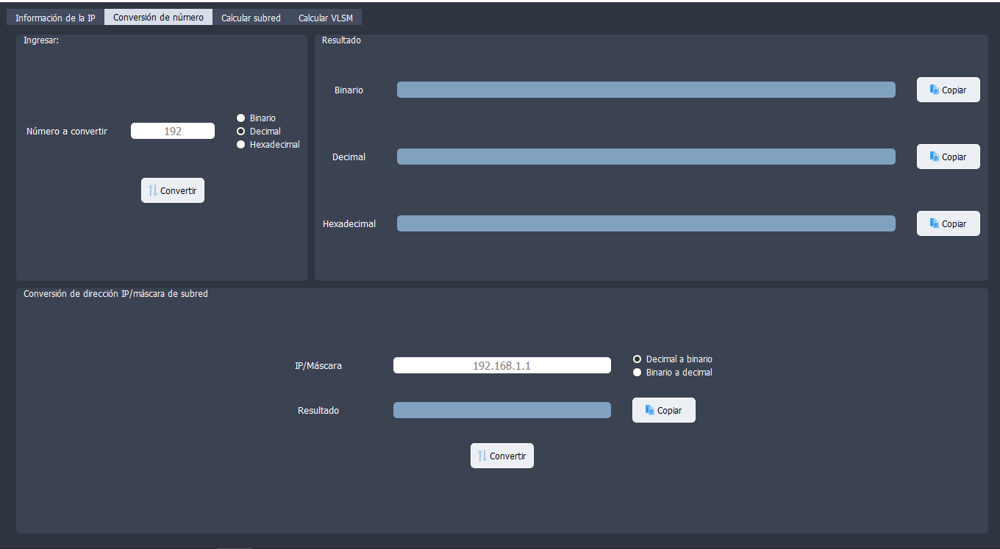

# Diagramador de Red
Una poderosa herramienta multifunción enfocada en facilitar la lógica del armado de una red.<br/>
La aplicación ha sido desarrollada en python usando PySide2.

## Características
- Información sobre una IP
    - Conversión de prefijo a máscara y viceversa
    - Información sobre una IP con prefijo
- Conversión numérica
    - Conversión numérica entre decimal, hexadecimal y binario
    - Conversión a binario de una dirección/máscara de red
- Calculadora de subnetting
- Calculadora de VLSM

## Requerimientos
- [Python 3.6 o mayor](https://www.python.org/downloads/)
- [Git (para clonar el proyecto)](https://git-scm.com/)

## Instalación
- **Solo disponible en Windows:**
    - Abre una terminal y clona el proyecto:
        
        ```bash
        git clone https://github.com/antarn88/NetworkAssistant.git
        ```
    - Crea un entorno virtual:
    
        ```bash
        cd NetworkAssistant
        python -m venv venv
        ```
    - Activa el entorno virtual:
    
        ```bash
        venv\Scripts\activate
        ```
    - Actualiza pip e installe los requerimientos:
    
        ```bash
        python -m pip install --upgrade pip
        pip install -r requirements.txt
        ```
    - Ejecuta la aplicación:
    
        ```bash
        NetworkAssistant.pyw
        ```

## Capturas
**Información de la IP:**


**Conversión Numérica:**



**Calculadora de Subnetting:**


**Calculadora de VLSM:**


